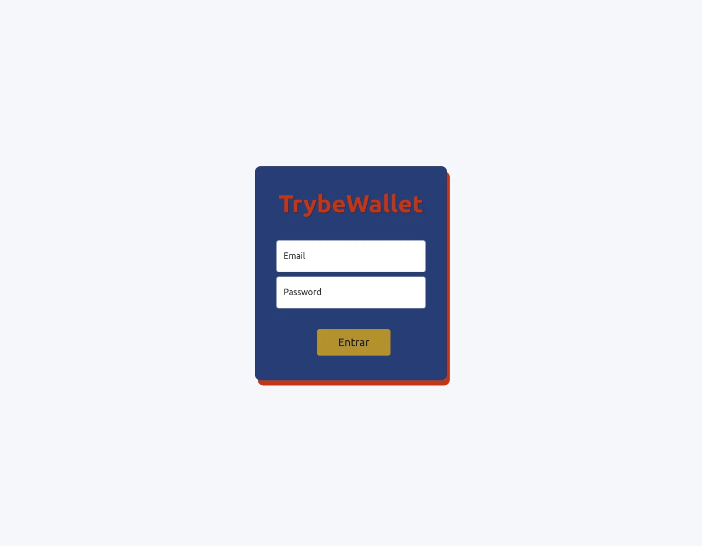
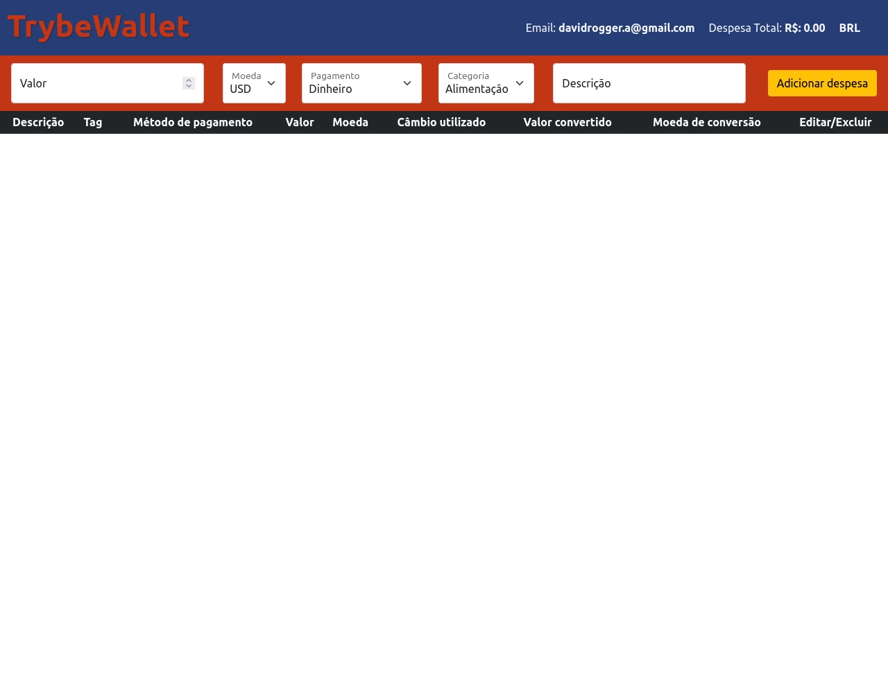
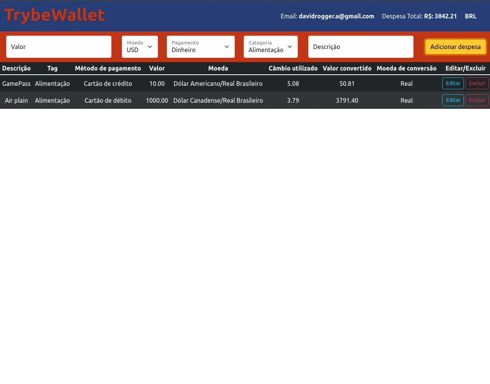

# Sobre

## Seção: `Gerenciamento de estado com Redux`
- Durante seções anteriores foi identificado um problema muito grande com relação a visualização do estado para diversos componentes, onde era preciso passar de componentes pai para filho via props o estados gerando prop drilling, que é algo bagunçado e confuso se forem muitos componentes entre outros diversos problemas, nessa seção aprendi a configurar e usar um gerenciador de estado o Redux, onde fica muito mais simples centralizar informações nele, e acessar os estados.
#

  

>*clique na imagem para acesso online do projeto*
#
## Projeto: `Trybewallet`

- Projeto cria uma carteira de conversão, usando uma API de câmbio de moeda, é possivel adicionar uma despesa com valores e uma moeda de escolha, listando despesa por despesa, e calculando a conversão final para reais. Pode-se editar a despesa e exclui-la após sua inserção.

# Tecnologias e ferramentas usadas 🛠

# Desafios

- Durante toda a seção e desenvolvimento do projeto, o redux em sua versão de classe é uma receita de bolo, onde precisamos entender os métodos necessários para fazer ele funcionar, tornando bem extenso sua configuração, configurar componente por componente mapeamento as propriedades do estado.
- Durante o desenvolvimento mesclei o uso do bootstrap com css file, para analisar a eficiencia do mesmo, minha visão inicial é que ele acaba deixando muito texto dentro da do código do projeto, poluindo muito o código. Como a baixa familiaridade com o uso do mesmo, acabou consumindo mais tempo, pois foi necessária a leitura da documentação, para entender qual classe era necessária e como ele funcionava, usar as funcionalidades e efeitos padrão do bootstrap foram bem interessantes, como o text floating, onde o texto fica flutuando dentro do input de texto, e ao acessar o input esse texto é reduzido e redimensionado no canto superior do input, alguns efeitos de houver nos botões e da tabela, provavelmente fazendo no css puro demorariam mais, fora ter um conhecimento mais vasto, pois me deparei com essas configurações e efeitos olhando a documentação e adotei-as para teste.

# Conclusão

- Fica bem mais simples de acessar e manipular os estados, antes era aquela cascata enorme passando propriedades de componentes por componentes para ter acesso aquela informação, apesar de extenso redux facilita e mantem o estado bem organizado e acessivel.

  

    <strong>
      :newspaper_roll: Requisitos solicitados durante o desenvolvimento do projeto
    </strong>
  

 
### Requisitos
*Nome* | *Avaliação*
--- | :---:
1 - Crie uma página inicial de login com os seguintes campos e características: | :heavy_check_mark:
2 - Crie uma página para sua carteira com as seguintes características: | :heavy_check_mark:
3 - Crie um header para a página de carteira contendo as seguintes características: | :heavy_check_mark:
4 - Implemente a lógica para armazenar no estado global as siglas das moedas que vêm da API | :heavy_check_mark:
5 - Desenvolva um formulário para adicionar uma despesa contendo as seguintes características:| :heavy_check_mark:
6 - Salve todas as informações do formulário no estado global | :heavy_check_mark:
7 - Desenvolva uma tabela com os gastos contendo as seguintes características: | :heavy_check_mark:
8 - Implemente a lógica para que a tabela seja alimentada pelo estado da aplicação | :heavy_check_mark:
9 - Crie um botão para deletar uma despesa da tabela contendo as seguintes características: | :heavy_check_mark:
10 - Crie um botão para editar uma despesa da tabela contendo as seguintes características: | :heavy_check_mark:

  

    <strong>
      :memo: Todo list
    </strong>
  

  - [x] - ~~Criar aplicação com base nos requisitos da trybe.~~ 
  - [ ] - Revisar Estilo dos elementos.
  - [ ] - Desenvolver testes automatizados.
  - [ ] - Adaptar elementos da aplicação para mobile.

#

  

